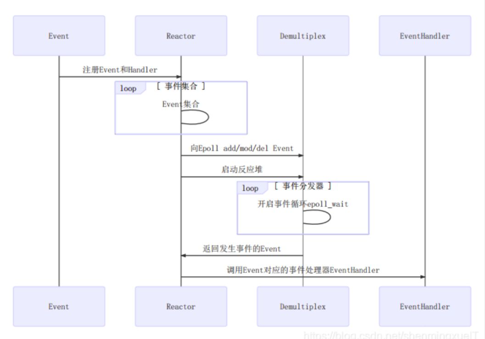
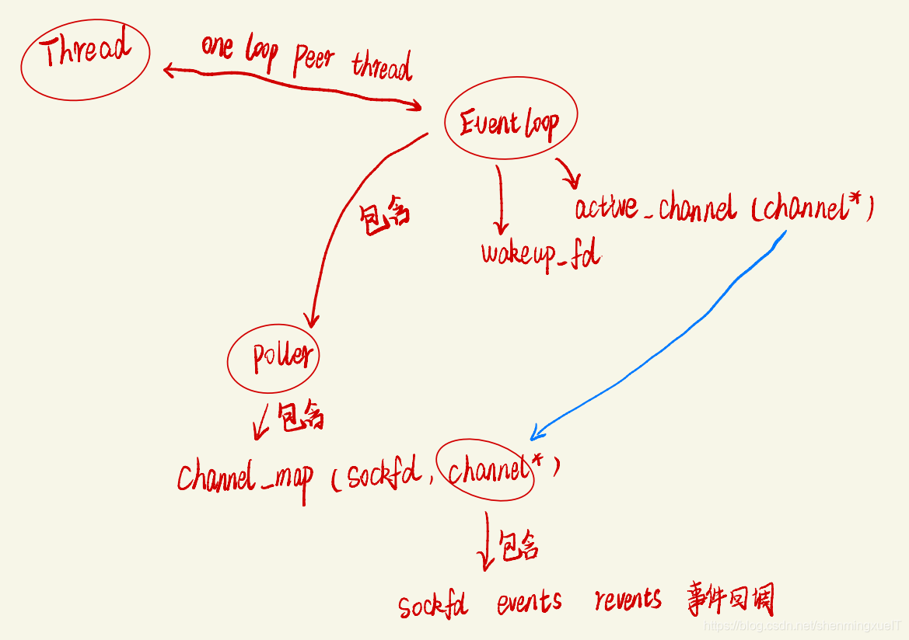

#### 学习手写moduo网络库

本项目是通过学习网络库moduo，学习优秀的代码设计，掌握基于事件驱动和回调的epoll，线程池面相对象编程

用C++ 14手写一遍网络库，不依赖boost

**项目进度：**

1. 核心类组件
2. TcpServer服务端

3. TcpClient编写客户端类（进行中...）

4. 支持定时事件TimerQueue 链表/队列 (后续学习)

5. DNS、HTTP、RPC（后续学习）

6. 丰富的使用示例examples目录（后续学习）


**基础知识：**

推荐阅读：《Linux高性能服务器编程》

陈硕官方:  https://github.com/chenshuo/muduo/

典型的一次IO的两个阶段是什么？ 数据准备 和 数据读写

数据准备：根据系统IO操作的就绪状态

阻塞

非阻塞

数据读写：根据应用程序和内核的交互方式

同步

异步

**陈硕大神原话：在处理 IO 的时候，阻塞和非阻塞都是同步 IO。只有使用了特殊的 API 才是异步**

**IO。**

**Unix/linux 五中IO模型**

阻塞blocking, 非阻塞 -non-blocking， IO复用，信号驱动，异步

好的模型：non-blocking + IO-multiplexing

**select：**

将已经连接的socket都放到一个文件描述符集合中，然后调用select函数将文件描述符拷贝到内核里，让内核检查网络事件产生（就是遍历一遍），当检查到有网络事件后，将次cokset标志为可读或可写，接着把整个文件描述符拷贝到用户态里，然后用户态还需要遍历，可读可写的socket，然后对其处理（2次遍历，两次拷贝）

自己理解的大白话（面试还是专业些）：

我们可以开设一个代收网点，让快递员全部送到代收点。这个网店管理员叫select。这样我们就可以在家休息了，麻烦的事交给select就好了。当有快递的时候，select负责给我们打电话，期间在家休息睡觉就好了。

但select 代收员比较懒，她记不住快递员的单号，还有快递货物的数量。她只会告诉你快递到了，但是是谁到的，你需要挨个快递员问一遍。

```
while true {
	select(流[]); //阻塞

  //有消息抵达
	for i in 流[] {
		if i has 数据 {
			读 或者 其他处理
		}
	}
}
```

poll和select类似 只是不用BitMap存储文件描述符，取而代之的是动态数组

**epoll:** 

- 与select，poll一样，对I/O多路复用的技术
- 只关心“活跃”的链接，无需遍历全部描述符集合
- 能够处理大量的链接请求(系统可以打开的文件数目)
- 使用红黑树跟踪进程所有待检测的文件描述符
  - 使用时间驱动机制，内核里维护了一个链表记录事件，当我某个socket事件发生后通过回调函数内核会将其加入事件列表中用户调用epoll_wait() 返回文件描述符的个数不需要select/poll轮询整个socket集合
  - poll的服务态度要比select好很多，在通知我们的时候，不仅告诉我们有几个快递到了，还分别告诉我们是谁谁谁。我们只需要按照epoll给的答复，来询问快递员取快递即可。

```
while true {
	可处理的流[] = epoll_wait(epoll_fd); //阻塞

  //有消息抵达，全部放在 “可处理的流[]”中
	for i in 可处理的流[] {
		读 或者 其他处理
	}
}
```


接口API：

int epoll_create(int size);

epoll_ctl(epfd, EPOLL_CTL_ADD, 5, &new_event);

nt epoll_wait(int epfd, struct epoll_event *event,
							 int maxevents, int timeout);

示例：

```C
int epfd = epoll_crete(1000);

//将 listen_fd 添加进 epoll 中
epoll_ctl(epfd, EPOLL_CTL_ADD, listen_fd,&listen_event);

while (1) {
	//阻塞等待 epoll 中 的fd 触发
	int active_cnt = epoll_wait(epfd, events, 1000, -1);

	for (i = 0 ; i < active_cnt; i++) {
		if (evnets[i].data.fd == listen_fd) {
			//accept. 并且将新accept 的fd 加进epoll中.
		}
		else if (events[i].events & EPOLLIN) {
			//对此fd 进行读操作
		}
		else if (events[i].events & EPOLLOUT) {
			//对此fd 进行写操作
		}
	}
}
```

**水平触发：**

如果用户在监听`epoll`事件，当内核有事件的时候，会拷贝给用户态事件，但是**如果用户只处理了一次，那么剩下没有处理的会在下一次epoll_wait再次返回该事件**

**边缘触发：**

相对跟水平触发相反，当内核有事件到达， 只会通知用户一次，至于用户处理还是不处理，以后将不会再通知。这样减少了拷贝过程，增加了性能，但是相对来说，如果用户马虎忘记处理，将会产生事件丢的情况。


简单的epoll服务器：

```c
// 服务端
#include <stdio.h>
#include <stdlib.h>
#include <ctype.h>
#include <string.h>

#include <unistd.h>
#include <sys/types.h>
#include <sys/socket.h>
#include <arpa/inet.h>

#include <sys/epoll.h>

#define SERVER_PORT (7778)
#define EPOLL_MAX_NUM (2048)
#define BUFFER_MAX_LEN (4096)

char buffer[BUFFER_MAX_LEN];

void str_toupper(char *str)
{
    int i;
    for (i = 0; i < strlen(str); i ++) {
        str[i] = toupper(str[i]);
    }
}

int main(int argc, char **argv)
{
    int listen_fd = 0;
    int client_fd = 0;
    struct sockaddr_in server_addr;
    struct sockaddr_in client_addr;
    socklen_t client_len;

    int epfd = 0;
    struct epoll_event event, *my_events;

    / socket
        listen_fd = socket(AF_INET, SOCK_STREAM, 0);

    // bind
    server_addr.sin_family = AF_INET;
    server_addr.sin_addr.s_addr = htonl(INADDR_ANY);
    server_addr.sin_port = htons(SERVER_PORT);
    bind(listen_fd, (struct sockaddr*)&server_addr, sizeof(server_addr));

    // listen
    listen(listen_fd, 10);

    // epoll create
    epfd = epoll_create(EPOLL_MAX_NUM);
    if (epfd < 0) {
        perror("epoll create");
        goto END;
    }

    // listen_fd -> epoll
    event.events = EPOLLIN;
    event.data.fd = listen_fd;
    if (epoll_ctl(epfd, EPOLL_CTL_ADD, listen_fd, &event) < 0) {
        perror("epoll ctl add listen_fd ");
        goto END;
    }

    my_events = malloc(sizeof(struct epoll_event) * EPOLL_MAX_NUM);


    while (1) {
        // epoll wait
        int active_fds_cnt = epoll_wait(epfd, my_events, EPOLL_MAX_NUM, -1);
        int i = 0;
        for (i = 0; i < active_fds_cnt; i++) {
            // if fd == listen_fd
            if (my_events[i].data.fd == listen_fd) {
                //accept
                client_fd = accept(listen_fd, (struct sockaddr*)&client_addr, &client_len);
                if (client_fd < 0) {
                    perror("accept");
                    continue;
                }

                char ip[20];
                printf("new connection[%s:%d]\n", inet_ntop(AF_INET, &client_addr.sin_addr, ip, sizeof(ip)), ntohs(client_addr.sin_port));

                event.events = EPOLLIN | EPOLLET;
                event.data.fd = client_fd;
                epoll_ctl(epfd, EPOLL_CTL_ADD, client_fd, &event);
            }
            else if (my_events[i].events & EPOLLIN) {
                printf("EPOLLIN\n");
                client_fd = my_events[i].data.fd;

                // do read

                buffer[0] = '\0';
                int n = read(client_fd, buffer, 5);
                if (n < 0) {
                    perror("read");
                    continue;
                }
                else if (n == 0) {
                    epoll_ctl(epfd, EPOLL_CTL_DEL, client_fd, &event);
                    close(client_fd);
                }
                else {
                    printf("[read]: %s\n", buffer);
                    buffer[n] = '\0';
#if 1
                    str_toupper(buffer);
                    write(client_fd, buffer, strlen(buffer));
                    printf("[write]: %s\n", buffer);
                    memset(buffer, 0, BUFFER_MAX_LEN);
#endif

                    /*
                       event.events = EPOLLOUT;
                       event.data.fd = client_fd;
                       epoll_ctl(epfd, EPOLL_CTL_MOD, client_fd, &event);
                       */
                }
            }
            else if (my_events[i].events & EPOLLOUT) {
                printf("EPOLLOUT\n");
                /*
                   client_fd = my_events[i].data.fd;
                   str_toupper(buffer);
                   write(client_fd, buffer, strlen(buffer));
                   printf("[write]: %s\n", buffer);
                   memset(buffer, 0, BUFFER_MAX_LEN);

                   event.events = EPOLLIN;
                   event.data.fd = client_fd;
                   epoll_ctl(epfd, EPOLL_CTL_MOD, client_fd, &event);
                   */
            }
        }
    }

END:
    close(epfd);
    close(listen_fd);
    return 0;
}

// 客户端
#include <stdio.h>
#include <stdlib.h>
#include <string.h>
#include <strings.h>

#include <sys/types.h>
#include <sys/socket.h>
#include <arpa/inet.h>
#include <unistd.h>
#include <fcntl.h>

#define MAX_LINE (1024)
#define SERVER_PORT (7778)

void setnoblocking(int fd)
{
    int opts = 0;
    opts = fcntl(fd, F_GETFL);
    opts = opts | O_NONBLOCK;
    fcntl(fd, F_SETFL);
}

int main(int argc, char **argv)
{
    int sockfd;
    char recvline[MAX_LINE + 1] = {0};

    struct sockaddr_in server_addr;

    if (argc != 2) {
        fprintf(stderr, "usage ./client <SERVER_IP>\n");
        exit(0);
    }


    // 创建socket
    if ( (sockfd = socket(AF_INET, SOCK_STREAM, 0)) < 0) {
        fprintf(stderr, "socket error");
        exit(0);
    }


    // server addr 赋值
    bzero(&server_addr, sizeof(server_addr));
    server_addr.sin_family = AF_INET;
    server_addr.sin_port = htons(SERVER_PORT);

    if (inet_pton(AF_INET, argv[1], &server_addr.sin_addr) <= 0) {
        fprintf(stderr, "inet_pton error for %s", argv[1]);
        exit(0);
    }


    // 链接服务端
    if (connect(sockfd, (struct sockaddr*) &server_addr, sizeof(server_addr)) < 0) {
        perror("connect");
        fprintf(stderr, "connect error\n");
        exit(0);
    }

    setnoblocking(sockfd);

    char input[100];
    int n = 0;
    int count = 0;


    // 不断的从标准输入字符串
    while (fgets(input, 100, stdin) != NULL)
    {
        printf("[send] %s\n", input);
        n = 0;
        // 把输入的字符串发送 到 服务器中去
        n = send(sockfd, input, strlen(input), 0);
        if (n < 0) {
            perror("send");
        }

        n = 0;
        count = 0;


        // 读取 服务器返回的数据
        while (1)
        {
            n = read(sockfd, recvline + count, MAX_LINE);
            if (n == MAX_LINE)
            {
                count += n;
                continue;
            }
            else if (n < 0){
                perror("recv");
                break;
            }
            else {
                count += n;
                recvline[count] = '\0';
                printf("[recv] %s\n", recvline);
                break;
            }
        }
    }

    return 0;
}
```

1、单个进程能够监视的文件描述符的数量存在最大限制，通常是1024，当然可以更改数量，但由于

select采用轮询的方式扫描文件描述符，文件描述符数量越多，性能越差；(在linux内核头文件中，有

这样的定义：#define __FD_SETSIZE 1024

2、内核 / 用户空间内存拷贝问题，select需要复制大量的句柄数据结构，产生巨大的开销

3、select返回的是含有整个句柄的数组，应用程序需要遍历整个数组才能发现哪些句柄发生了事件

4、select的触发方式是水平触发，应用程序如果没有完成对一个已经就绪的文件描述符进行IO操作，

那么之后每次select调用还是会将这些文件描述符通知进程

相比select模型，poll使用链表保存文件描述符，因此没有了监视文件数量的限制，但其他三个缺点依

然存在。

以select模型为例，假设我们的服务器需要支持100万的并发连接，则在__FD_SETSIZE 为1024的情况

下，则我们至少需要开辟1k个进程才能实现100万的并发连接。除了进程间上下文切换的时间消耗外，

从内核/用户空间大量的句柄结构内存拷贝、数组轮询等，是系统难以承受的。因此，基于select模型的

服务器程序，要达到100万级别的并发访问，是一个很难完成的任务。

**Reactor模型**

**重要组件**：**Event事件、Reactor反应堆、Demultiplex事件分发器、Evanthandler事件处理器**

参考博文：https://xiaolincoding.com/os/8_network_system/reactor.html


|       组件       |              作用              | 对应代码（参考你的 `EchoServer`）  |
| :--------------: | :----------------------------: | :--------------------------------: |
|    **Event**     | 事件抽象（如新连接、数据到达） |     `TcpConnection` 的读写事件     |
|   **Reactor**    |      事件注册与核心调度器      |     `EventLoop` + `TcpServer`      |
| **Demultiplex**  |  系统级事件监听（如 `epoll`）  | `Poller`（底层调用 `epoll_wait`）  |
| **EventHandler** |       事件的具体处理逻辑       | `EchoServer::onMessage` 等回调函数 |





**流程图步骤**：


------

### **2. 关键设计思想**

#### **(1) 事件驱动-Driven）**

- **优势**：避免轮询，CPU 仅在事件发生时被占用（高并发场景高效）。
- **你的代码体现**：`loop.loop()` 是事件循环的核心，阻塞在 `epoll_wait` 直到事件发生。

#### **(2) 非阻塞 I/O**

- `Reactor` 通常配合非阻塞 Socket（如 `conn->shutdown()` 直接操作，不阻塞线程）。

#### **(3) 职责分离**

- `Reactor` 负责调度，`EventHandler` 负责业务逻辑（如 `EchoServer` 只关注 `onMessage` 的回显逻辑）。

**muduo网络库的核心代码模块**

fd、events、revents、callbacks 两种channel listenfd-acceptorChannel connfd

connectionChannel

**Poller和EPollPoller - Demultiplex**

std::unordered_map<int, Channel*> channels

**EventLoop - Reactor**

ChannelList activeChannels_;

std::unique_ptr poller_;

int wakeupFd; -> loop

std::unique_ptr wakeupChannel ;

**Thread和EventLoopThread**

**EventLoopThreadPool**

getNextLoop() : 通过轮询算法获取下一个subloop baseLoop

一个thread对应一个loop => one loop per thread

**Socket**

**Acceptor**

主要封装了listenfd相关的操作 socket bind listen baseLoop

**Buffer**

缓冲区 应用写数据 -> 缓冲区 -> Tcp发送缓冲区 -> send

prependable readeridx writeridx

**TcpConnection**

一个连接成功的客户端对应一个TcpConnection Socket Channel 各种回调 发送和接收缓冲

区**TcpServer**

Acceptor EventLoopThreadPool

ConnectionMap connections_;
